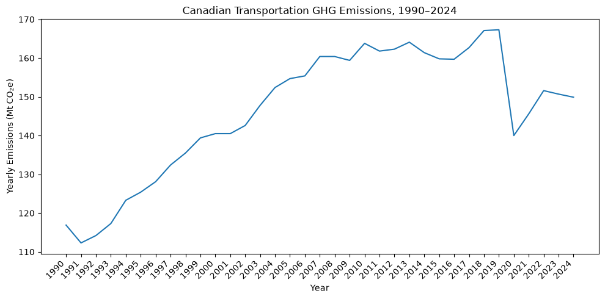
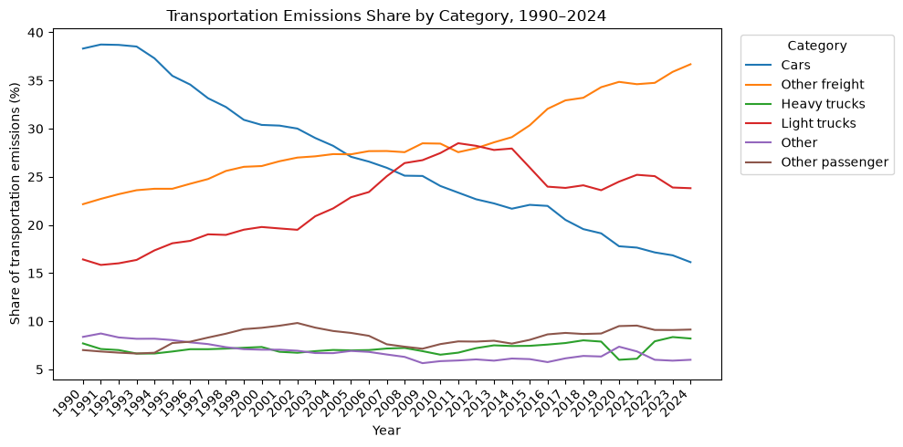
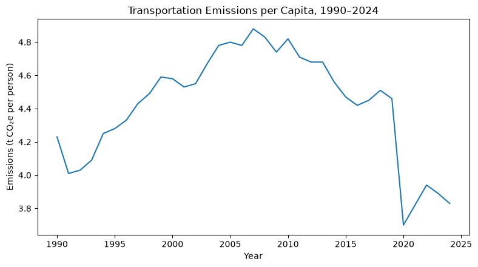

# Canadian Transportation GHG Emissions Analysis

An exploratory data analysis of **35 years of Canadian transportation greenhouse gas emissions**, examining how emissions have changed over time and how those changes relate to transportation type, population growth, economic output, and vehicle fuel efficiency.

**Period analyzed:** 1990–2024
**Tools:** Python, Pandas, NumPy, Matplotlib, Seaborn

---

## Project Overview

Transportation is a major source of greenhouse gas emissions in Canada, but the overall emissions trend does not show which types of transportation are driving those changes.

This project combines multiple Canadian public datasets to investigate:

* How have total transportation emissions changed since 1990?
* Which transportation categories have contributed most to long-term increases and decreases?
* How has the composition of passenger and freight emissions changed?
* How have emissions changed after accounting for population growth?
* How have transportation emissions changed relative to Canada's economic output?
* How are GDP, population, light-duty vehicle emissions, and vehicle fuel-efficiency measures associated with transportation emissions?
* Do these relationships become stronger when explanatory variables are shifted several years earlier?

---

## Key Findings

### Transportation emissions remain above 1990 levels

Canadian transportation emissions increased from **116.9 Mt CO₂e in 1990 to 149.9 Mt CO₂e in 2024**, an increase of approximately **28%**.

Emissions reached a peak of **167.3 Mt CO₂e in 2019** before falling sharply in 2020. By 2024, emissions had partially recovered but remained approximately **10% below the 2019 peak**.



### The composition of transportation emissions changed substantially

The overall increase in emissions was not shared evenly across transportation categories.

Between 1990 and 2024:

* **Car emissions decreased by approximately 46%**
* **Light-truck emissions increased by approximately 112%**
* **Heavy-truck emissions increased by approximately 86%**
* Total transportation emissions increased by approximately **28%**

The decline in car emissions was therefore offset by substantial growth in emissions from light trucks and heavy-duty freight vehicles.



Passenger transportation also represented a smaller share of total transportation emissions over time, while the freight share generally increased.

### Population growth does not fully explain the long-term trend

To account for Canada's growing population, total transportation emissions were converted to emissions per capita.

Per-capita transportation emissions peaked earlier than total emissions and generally declined afterward, even while Canada's population continued to grow.

This suggests that **population growth alone cannot explain the long-term change in total transportation emissions**.



### Transportation emissions grew more slowly than economic output

Transportation emissions were also normalized using real Canadian GDP.

Transportation emissions intensity relative to GDP declined substantially over the study period, indicating that **real economic output grew faster than transportation emissions**.

This does not mean that economic growth caused emissions to decline. Rather, it provides another way of comparing transportation emissions with broader changes in the Canadian economy.

---

## Data Sources

The analysis combines public datasets from Canadian government sources:

| Dataset                                 | Source                                | Use in Analysis                                             |
| --------------------------------------- | ------------------------------------- | ----------------------------------------------------------- |
| Transportation greenhouse gas emissions | Environment and Climate Change Canada | Total and category-level transportation emissions           |
| Canadian population estimates           | Statistics Canada                     | Per-capita emissions                                        |
| Gross domestic product                  | Statistics Canada                     | Transportation emissions intensity relative to GDP          |
| Fuel consumption ratings                | Natural Resources Canada              | Trends in rated efficiency of new light-duty vehicle models |

The core transportation dataset separates emissions into:

* Passenger cars
* Passenger light trucks
* Other passenger transportation
* Heavy-duty freight trucks
* Other freight transportation
* Other transportation sources

---

## Analysis

### 1. Data Cleaning and Preparation

The transportation emissions dataset was cleaned and standardized using Pandas.

This included:

* Renaming long source column names
* Converting annual observations into analysis-friendly formats
* Calculating total transportation emissions
* Calculating year-over-year absolute and percentage changes
* Reshaping category data for comparison and visualization

Additional datasets were cleaned separately before being joined by year.

---

### 2. Long-Term Emissions Trends

Annual transportation emissions were examined from 1990 through 2024.

The analysis compares:

* The full **1990–2024** period
* The pre-pandemic **1990–2019** period
* The more recent **2019–2024** period

Separating these periods helps prevent the unusually large transportation disruption in 2020 from obscuring the longer-term trend.

---

### 3. Transportation Category Analysis

Changes in emissions were calculated separately for each transportation category.

Both absolute emissions and each category's share of total transportation emissions were examined to determine how the composition of Canadian transportation emissions has changed.

Passenger and freight categories were also grouped to compare their relative contribution over time.

---

### 4. Per-Capita Emissions

Population estimates were joined with the transportation dataset by year.

Transportation emissions per capita were calculated as:

```text
Transportation emissions per capita =
Total transportation emissions / Population
```

This allows the national emissions trend to be compared with Canada's population growth.

---

### 5. Emissions Intensity of GDP

Real GDP data were added to examine transportation emissions relative to Canadian economic output.

```text
Transportation emissions intensity =
Total transportation emissions / Real GDP
```

This metric provides a different perspective from absolute emissions by measuring the amount of transportation emissions associated with a given level of economic output.

---

### 6. Vehicle Fuel Efficiency

Historical fuel-consumption ratings for new light-duty vehicle models were used to examine changes in rated vehicle efficiency.

Average city, highway, combined fuel consumption, and CO₂ ratings were calculated by model year.

Disclaimer: This data is used as **contextual evidence of technological change**, rather than as a direct measure of Canada's vehicle fleet.

---

### 7. Correlation Analysis

Relationships between transportation emissions and several selected factors were explored using correlation matrices.

Variables included:

* Population
* Real GDP
* Light-duty vehicle emissions
* Average rated vehicle fuel consumption

The analysis compared both:

1. Correlations between the original annual values
2. Correlations between year-over-year percentage changes

Many of the strong correlations observed using the original values became substantially weaker after examining annual changes.

This demonstrates an important issue when working with time-series data: **variables may appear highly correlated simply because they follow similar long-term trends**.

---

### 8. Lagged Relationships

The previous section lead to correlations being calculated for explanatory variables across previous years denoted as "lag" periods.

Across the tested lag periods, correlations were generally strongest when variables were measured in the same year.

However, GDP and population change relatively gradually over time, meaning that shifting these series by several years does not dramatically change their overall shape.

The lag analysis therefore provides limited evidence for distinguishing immediate relationships from delayed ones.

---

## Limitations

This project is exploratory and does **not establish causal relationships** between the variables analyzed.

Several limitations should be considered:

* The analysis contains only about 35 annual observations.
* National-level data can hide important provincial and regional differences.
* The COVID-19 pandemic created an unusually large disruption to transportation activity.
* GDP, population, and several emissions measures contain strong long-term trends that can inflate correlations.
* Fuel-efficiency values are simple averages across vehicle models available in a given year.
* Fuel-efficiency averages are **not weighted by vehicle sales or fleet composition** and therefore should not be interpreted as the average efficiency of vehicles actually driven in Canada.
* Other potentially important factors, such as fuel prices, kilometres travelled, vehicle ownership, EV adoption, and transportation policy, are not directly included but may be a focus of future analysis

---

## Technologies Used

**Data analysis**

* Python
* Pandas
* NumPy

**Visualization**

* Matplotlib
* Seaborn

**Development**

* Jupyter Notebook
* Git / GitHub

---

## Repository Structure

```text
.
├── data/
│   ├── ghg-emissions-transport-en.csv
│   ├── population-data.csv
│   ├── gdp-data.csv
│   ├── 1995-2014-fuel-consumption-ratings.csv
│   └── my2015-2024-fuel-consumption-ratings.csv
│
├── images/
│   ├── total_emissions.png
│   ├── category_emissions.png
│   └── emissions_per_capita.png
│
├── notebooks/
│   └── emissions_analysis.ipynb
│
└── README.md
```

---


## Future Work

Possible extensions to the project include:

* Examining emissions at the provincial level
* Incorporating vehicle-registration and EV-adoption data
* Including vehicle kilometres travelled
* Investigating fuel-price relationships
* Separating passenger and freight economic drivers
* Using higher-frequency data to better study short-term relationships
* Comparing transportation emissions trends with other major Canadian emissions sectors
* Investigating national policy efforts on transportation emissions reduction

---

## Takeaway

Canadian transportation emissions increased substantially between 1990 and 2024, but the overall trend hides important structural changes.

Emissions from passenger cars declined considerably, while emissions from light trucks and heavy-duty freight vehicles grew. At the same time, transportation emissions per capita and emissions relative to economic output show different trends from total emissions.


